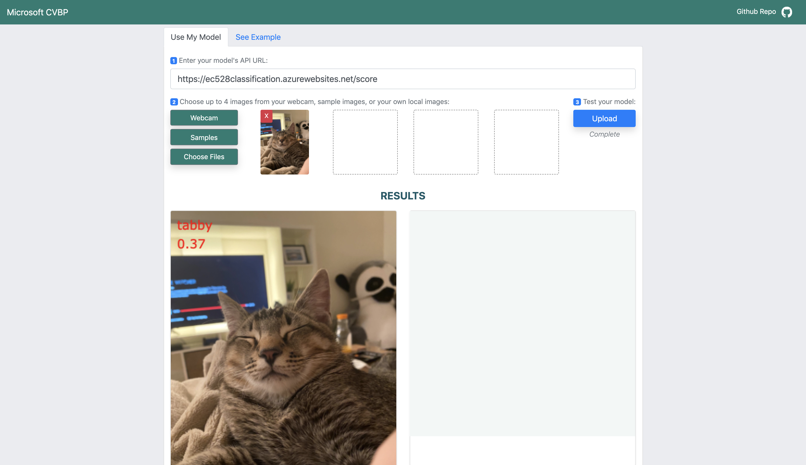
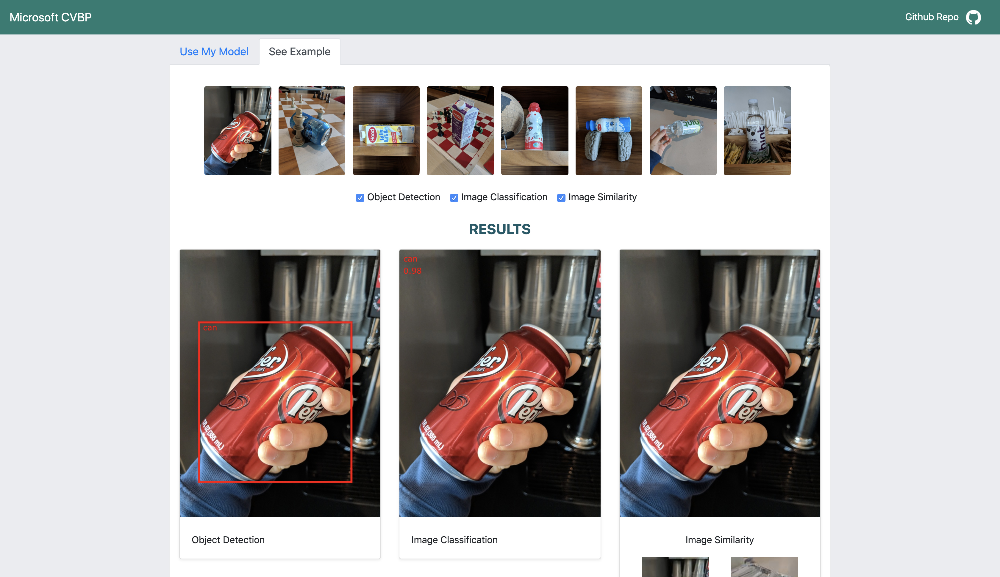

## Building a Deployable Application to Visualize the Output of a Deep Neural Network (DNN) Model

Team: Matthew Boyd, Charles Henneberger, Xushan "Mulla" Hu, SeungYeun "Kelly" Lee, Nuwapa "Prim" Promchotichai  
Mentors: Patrick Buehler, Young Park, JS Tan

*Updated: May 2, 2020*

#### Contents

0. [Sprint Presentations](#sprint-presentations)
1. [Vision and Goals Of The Project](#vision-goals)
2. [Users/Personas Of The Project](#users-personas)
3. [Scope and Features of the Project](#scope-features)
4. [Solution Concept](#solution-concept)
5. [Acceptance Criteria](#acceptance-criteria)
6. [Release Planning](#release-planning)
7. [How to install and run the project](#install-run)

## Course Contents

#### For demo:
* [Pull Request link](https://github.com/mcboyd-bu/computervision-recipes/tree/contrib_html_demo/contrib/html_demo)
* [Deployed UI](https://ec528simtest.blob.core.windows.net/ec528simtest/index.html)

#### Final Presentation & Video Recording
* [Final Presentation](https://docs.google.com/presentation/d/1p4YKnUZrRpQU7KijOA1PT55oeCP8YcHYFsjS2q-X7e8/edit?usp=sharing)

#### Paper Presentation
[EbbRT Paper Presentation](https://docs.google.com/presentation/d/e/2PACX-1vS__BZnB0DOHts27Xy7mbrzuihj3NCLJqTEy0SGE59aD2FTb8tLfRyOVHXdg--Fl12IZK5yiBSiU9S_/pub?start=false&loop=false&delayms=3000)


<a name="sprint-presentations"/>

## 0. Sprint Presentations

1. [Sprint 1](https://docs.google.com/presentation/d/1YJg0whEUxonBOJON-ExQi6li-OhU5VPepP93H8fXChw/edit?usp=sharing)
2. [Sprint 2](https://docs.google.com/presentation/d/1hkqTPE9fNCRs7QkaELIBK1OSxYvn8TqOkDwcS2QG1_o/edit?usp=sharing)
3. [Sprint 3](https://docs.google.com/presentation/d/e/2PACX-1vQK62-UelDsav2z0NQxnhVZvvVc4rSX7UKYpC7E7_pOrJso_WwE5MalFHqyyqyUJK_AVrTSesXwhf02/pub?start=false&loop=false&delayms=10000)
4. [Sprint 4](https://docs.google.com/presentation/d/e/2PACX-1vRIiyPYAzG6Amfh6nCoxzAFCrNwjDsKj0FHbRbf2pdrmHBDS4wSKhoE6sC6WU5Xfa5EOSA3Eei0STx1/pub?start=false&loop=false&delayms=3000
)
5. [Sprint 5](https://docs.google.com/presentation/d/1mIWCY0Zoe-XiN_F12nO8Dr-s3WKh5lZNGZBeu_A_PJA/edit?usp=sharing)


<a name="vision-goals"/>

## 1. Vision and Goals Of The Project

The goal of the project is to develop an application for users to upload images and visualize the output of deployed Deep Neural Network (DNN) models in a simple HTML user interface
* Provide a user interface that allows users to visualize the output of a deployed computer vision model. Users can improve on and gain insights from their deployed model by storing test images in a file system and examining them for correctness through the user interface. This user interface should be deployed to the cloud.
* Provide a modular way for different models and different input/output signatures.

<a name="users-personas"/>

## 2. Users/Personas Of The Project

Target Audience:

* General data scientists, software engineers, and professional computer vision experts who are developing/testing Deep Neural Networks (DNNs) that want an easier way to visualize their outputs

<a name="scope-features"/>

## 3. Scope and Features of the Project

* UI/Frontend
    * Simple site for users to upload and view images and DNN results
    * Allows images to be shown with API-returned rectangle coordinates for object classification and tracing
    * Supports visualizations for multiple DNN scenarios, as well as the ability to switch between them
    * Flexible display to accommodate tablet and mobile devices
    * Enable basic interactivity
    * Allows images to be uploaded from other sources, such as webcam
* REST API
    * Can deploy and run DNN model via provided Jupyter notebooks
    * Can run model via cloud service
    * Can take single image as input, or do batch scoring with multiple images
    * API scenarios include Classification, Similarity, Detection, and possibly keypoints, but can support user defined scenarios as well
* Image Similarity
   * Implement UI which, given a query image, shows the top N similar reference images.
   * Precomputes features locally for reference set, and stores them on disk for later use
   * Can deploy UI to the cloud

<a name="solution-concept"/>

## 4. Solution Concept

System components that are building blocks of the design:
 * Jupyter Notebooks: walk users through creating and “publishing” DNN models
 * DNN Models: users’ trained models
 * UI-DNN: HTML interface for testing published DNN models (all except “Similarity” DNN models)
 * UI-DNN-Sim: HTML interface for testing published “Similarity” DNN models
 * Test Images: existing images the user uploads through UI-DNN or UI-DNN-Sim to test their models
 * Capture Images: realtime webcam images captured by UI-DNN or UI-DNN-Sim to test models
 * Azure Container/Kubernetes: DNN model publishing locations, with focus on simplicity and low cost (e.g., CPU vs GPU resources) - can publish to either service
 * REST API: communication end-point where UI elements and Azure-published models interact
     * Models must implement scoring functions as outlined in the Miscrosoft CVBP repository
 * Local Web Server: used to serve/execute UI elements in MVP
 * Azure Blob Storage: alternate publishing location for UI elements (as stretch goal)


Figure 1: Proposed architecture
Many design decisions have not been made yet. Three notable decisions evident above:
 * “Similarity” DNN models may be kept local (and not published to Azure) based on current best practices due to the complexity of executing them - still investigating.
  * UI-DNN-Sim as separate code: since it will return a list of similar images to be displayed (vs. text / bounding boxes for the other models), the interface will differ significantly; also, since it will interface with local models and code for finding similar images, even after publishing to the cloud, it will have different requirements.
 * Server requirement (local or cloud) for UI elements: REST APIs and local file APIs (for loading test images) cannot be accessed if the HTML/Javascript files are not loaded and access via a web server. These are web standards and cannot be avoided. 

<a name="acceptance-criteria"/>

## 5. Acceptance Criteria

Minimum acceptance criteria is a deployed UI (UI-DNN) which calls a cloud-based REST API and visualizes its output for multiple DNN scenarios (Image Classification and Object Detection).

Stretch goals are:
* UI supports visualization for image similarity model.
* REST API expands from single image input to taking multiple images as input; “batch scoring”
* Allows for the use of webcam as input.
* Improve visualizations for user interface; create appropriate UI for cell phone.
* Add another option on UI to allow users to view the example output of DNN models from Microsoft.

<a name="release-planning"/>

## 6. Release Planning

Plans are on Taiga: https://tree.taiga.io/project/mosayyebzadeh-building-deployable-application-visualizing-the-output-deep-neural-network/backlog

### Release #1 (due by Week 5 - Sprint 1):

UI: 
* Design a simple HTML interface for testing published DNN models via local web server
	* Create a hi-fi wireframe of the user interface

Image Similarity:
* Run “similarity” DNN model via provided Jupyter notebooks (00, 01, 12) on Microsoft CVBP github repository.
* Summarize pain points from the provided Jupyter notebooks and present the pain points to mentors.

API:
* Run 00, 01, and 03 image classification Jypyter notebooks from Microsoft CVBP github repository.
* Summarize pain points with CVBP github repo and present the pain points to mentors.

### Release #2 (due by Week 7 - Sprint 2):

UI: 
* Implement simple HTML interface for testing published DNN models based on hi-fi wireframe designed 
* Add functionalities to the front-end so that:
	* website allows single image input
	* webite shows uploaded image with hard-coded rectangle co-ordinates (to visualize the output of DNN models)
	* there is error checking for valid API input
	
Image Similarity:
* Write up image similarity Jupyter notebook to:
	* Precomputes image features for reference set, and stores on disk
	* Load precomputed features and compare with a query image (on local machine, code is provided in the notebooks)
* Explore options to upload “similarity” DNN models to cloud, execute if action is plausible

API: 
* Deploy API using the provided CVBP notebooks to cloud
 
### Release #3 (due by Week 9 - Sprint 3):

UI:
* Add functionalities to front-end and back-end:
	* Website allows multiple images (upto 4 images) input and display the 4 input images.
	* Create two tabs on UI; first tab allows users to test and visualize their own DNN models, second tab allows users to select from example set of images and visualize the output of DNN model from Microsoft on the example set of images.
	* Website display the visualization of DNN model output from deployed API on 4 images.

Image Similarity:
* Test Image Similarity Jupyter notebook, verify that there are no errors.
* Implement simple HTML interface for testing published “similarity” DNN models via local web server
	* Site returns list of similar images to be displayed based on features
* Run website from local PC

API:
* Expand from taking single image input to do batch scoring with multiple images as input
* Deploy API to the cloud

 
### Release #4 (due by Week 11 - Sprint 4):

* Connect front-end and back-end to create a functional UI.

* Minimum viable product (MVP) is completed.

* Document and upload work to Microsoft CVBP github repository via code review

UI:
* Addition/Modification of UI elements:
	* Remove white spaces from the UI
	* Change modal pop-up to collapsible component.
	* Add steps on how to navigate the UI to the website.
	* Add "About" tab to give detailed information about the project on the website.


### Release #5 (due by Week 13 - Sprint 5):

* Wrap up the project.

* Document and upload work to CVBP via code review.

Evangelism:
* Blog about the work and share on social media
* Demo work to Microsoft via virtual Microsoft Lunch and Learn Session

<a name="install-run"/>

## 7. How to install and run the project 


### Project Description

This project provides an HTML web page that allows users to visualize the output of a deployed computer vision DNN model. Users can improve on and gain insights from their deployed model by uploading query/test images and examining the model's results for correctness through the user interface. The web page includes some sample query/test images from the Microsoft image set, as well as example output for 3 types of models: Image Classification, Object Detection, and Image Similarity.


### Contents

| Directory | Description |
| --- | --- |
| [JupyterCode](JupyterCode)| Contains helper notebooks that upload files and deploy models that allow the web page to work |
| [UICode](UICode)| Contains HTML, CSS, and JavaScript files to implement the web page |
| [media](media)| Image files embedded as screenshots in this and other readmes |


### Requirements

This repo has the following requirements:
- Azure account
- [Azure CLI](https://docs.microsoft.com/en-us/cli/azure/install-azure-cli?view=azure-cli-latest)
- Conda environment created in the computervision-recipes [Setup Guide](https://github.com/microsoft/computervision-recipes/blob/master/SETUP.md)

Some of the notebooks in the JupyterCode repository will also instruct you to run some of the existing [scenario notebooks](https://github.com/microsoft/computervision-recipes/tree/master/scenarios).

### Usage

#### Setup
- Clone the repo
```bash
git clone git@github.com:microsoft/ComputerVision.git
```

- Execute the notebooks in JupyterCode in your conda environment to deploy a model and upload necessary code for the web page to work

#### Using the web page

To use a deployed model in the Use My Model tab:

1. Enter the model's API URL in the text field
2. Upload or select images to use:
	* Webcam
		* Allow the browser to use your web cam
		* Select Capture Image to take a picture
		* Select Add Images to add the captured image
	* Samples
    		* Select an image by clicking on it
	* Choose Files
		* Select images to upload from your machine's file explorer
4. Select Upload to send the images to the model's API
5. View results below!

To view examples in the See Example tab:

1. Click on an image you wish to view
2. See results from image classification, object detection, and image similarity models below!


### Photo
Below is a screenshot of the working website with Use My Model 

In "Use My Model" tab on the website, users can select multiple images and test their DNN model's API and see the visualization of the model's API.



In "See Example" tab on the website, users can click on example images and view the visualization of three DNN models (Image Classification, Object Detection, Image Similarity)




### Authors -- don't know if we still need this section here

This work was completed by a team of students from the Boston University College of Engineering as part of the EC528 Cloud Computing class. The project was completed in collaboration with three Microsoft engineers who proposed the project and acted as team mentors.

**Student team:** Matthew Boyd, Charles Henneberger, Xushan "Mulla" Hu, SeungYeun "Kelly" Lee, Nuwapa "Prim" Promchotichai

**Microsoft mentors:** Patrick Buehler, Young Park, JS Tan

### FAQ

Q: Is an Azure account required to run this code?

A: No. Navigate the UICode folder and open the Index.html file in your browser. You will be able to view examples of model visualizations without having an Azure account.

Q: Can I use my own model instead of the ones uploaded by the notebooks?

A: Yes, you will just need to substitute your model where the other model is used.

Q: Why am I getting CORS issues when running a model/example?

A: In order to run the website and call models, you must enable CORS for the location of the html file on the app service. See the end of section 3.F in [3_deployment_to_azure_app_service.ipynb](JupyterCode/3_deployment_to_azure_app_service.ipynb).

Q: How do I enable CORS on items in my Blob storage account?

A: Open your storage account in the Azure portal. In the left-hand pane under "Settings" click on "CORS". Add a new entry indicating the origin of your request (or * to allow all requests) in the "Allowed origins" column and save your entry.


